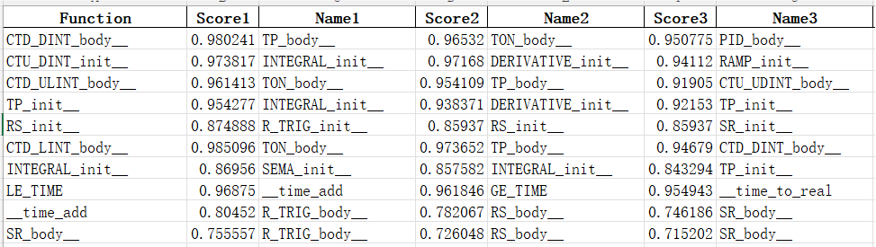
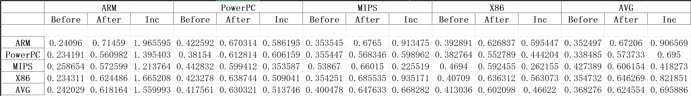
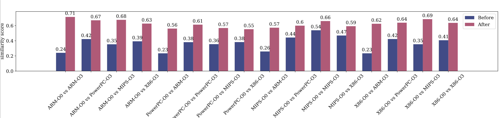
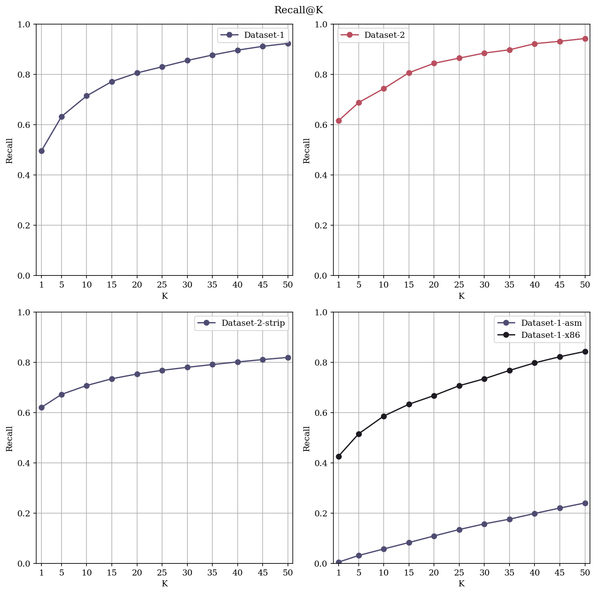

# ReGraph

Our experiments are conducted in a Linux machine with NVIDIA GPUs, we haven't done compatibility tests on other platforms.

## 0. Run the entire experiment in a Docker container [Optional]

In order not to mess up with your own environment, we recommend running the entire experiment in a Docker container.

```bash

# If you have an NVIDIA GPU with NVIDIA Container Toolkit installed
sudo docker run --rm --runtime=nvidia --gpus all -it -v /path/to/your/regraph:/regraph ubuntu:22.04
# Other with CPU only, run the following command
docker run --rm -it -v /path/to/your/regraph:/regraph ubuntu:22.04
apt-get update
apt-get install sudo git -y
cd
```

Then run the following commands to continue.

We don't pack the entire experiment into a Docker image since the docker the image size will be too large.

> NVIDIA-Docker is still incompatible with some old packages, if this happens, or you don't want to install NVIDIA-docker, use cpu only or install those dependencies on the host machine.

## 1. Environment setup

### 1.1 Install Retdec

[Retdec](https://github.com/avast/retdec) is used to lift binary to LLVM IR.

```bash
sudo apt-get install build-essential cmake git openssl libssl-dev python3 autoconf automake libtool pkg-config m4 zlib1g-dev upx doxygen graphviz curl unzip graphviz-dev pigz -y
git clone https://github.com/avast/retdec
cd retdec
mkdir build && cd build
cmake .. -DRETDEC_ENABLE_ALL=ON
make -j
make install
```

### 1.2 Install Joern

[Joern](https://github.com/joernio/joern) is used to generate CPGs

```bash
cd
mkdir joern && cd joern 
curl -L "https://github.com/joernio/joern/releases/download/v2.0.232/joern-install.sh" -o joern-install.sh
chmod u+x joern-install.sh
./joern-install.sh --interactive # Choose to create a symbolic link, and version tag is v2.0.232
```

### 1.3 Install Other Dependencies

Install the following dependencies:

```bash
sudo apt-get install -y python3 python3-pip python-is-python3 clang llvm gcc g++ g++-arm-linux-gnueabi g++-powerpc-linux-gnu g++-mips-linux-gnu openjdk-17-jdk openjdk-17-jre-headless
```

### 1.4 Install Python Dependencies

Clone our repository and install the required packages:

```bash
cd /regraph
# For GPU run this
pip install dgl -f https://data.dgl.ai/wheels/cu118/dgl-1.0.2%2Bcu118-cp310-cp310-manylinux1_x86_64.whl
# For CPU-only run this
pip install dgl -f https://data.dgl.ai/wheels/dgl-1.0.2-cp310-cp310-manylinux1_x86_64.whl

# For all
pip install -r requirements.txt

```

### 1.5 Unzip files

Here we provided 3 compressed files, which are `pretrained.tar.gz`, `graph_dataset_openplc_only.tar.gz`, `graph_dataset.tar.gz`

We uploaded these files in [Google Drive](https://drive.google.com/drive/folders/1WS_mKy-8LwH4I_Y_bn7maRacWVJX1ehA?usp=drive_link "Google Drive"). Once those files are downloaded, unzip any of them by running

```bash
tar --use-compress-program=pigz -xpf <filename>.tar.gz
```

The `graph_dataset_openplc_only` is a dataset for OpenPLC, which can be used to test the entire process.
The `graph_dataset` is a dataset for the entire process, which is 109GB after decompression. If you wish to test all the process, please unzip this file.

Make sure the entire folder structure is like this:

```bash
├── dataset.py
├── evaluate_openplc.py
├── functionality.py
├── generate_compare.py
├── generate_openplc_re.sh
├── graph_dataset
│   ├── dataset_1
│   ├── dataset_1_asm
│   ├── dataset_1_x86
│   ├── dataset_2
│   ├── dataset_2_decompressed_nostrip
│   ├── dataset_2_decompressed_stripped
│   └── openplc
├── graph_dataset_openplc_only.tar.gz
├── graph_dataset.tar.gz
├── inference.py
├── lift_reopt_cpg
│   ├── find_empty.py
│   ├── lift_process_asm.py
│   ├── lift_process.py
│   ├── lift_process_strip.py
│   ├── llvm_name_recover.py
│   └── nb_log_config.py
├── model.py
├── pictures
│   ├── functionality.png
│   ├── recall@k.png
│   ├── sample_pic_1.png
│   └── sample_pic_2.png
├── PreProcessor
│   ├── bsc_runner.py
│   ├── data_config.yaml
│   ├── DataGenerator.py
│   ├── dataset_1_runner.py
│   ├── dataset_2_runner.py
│   ├── FileScanner.py
│   ├── GraphConverter.py
│   ├── __init__.py
│   ├── openplc_runner.py
│   ├── RedisLoader.py
│   └── sample_runner.py
├── pretrained
│   ├── all_result.pkl
│   ├── dataset_1_asm.ckpt
│   ├── dataset_1.ckpt
│   ├── dataset_1_x86.ckpt
│   ├── dataset_2_all.ckpt
│   └── openplc.ckpt
├── pretrained.tar.gz
├── README.md
├── requirements.txt
├── Speed benchmark.py
├── train_config.yaml
└── train.py

```

## 2. Functionality Test

In the Functionality Test, we will go through a tiny example, OpenPLC.

run `python3 functionality.py --input1 <file1> --input2 <file2> --model <pretrained_model> --op_file <operator_file> -k <top K>` to get top K most similar functions.

```bash
python3 functionality.py --help
usage: functionality.py [-h] --input1 INPUT1 --input2 INPUT2 --model MODEL --op_file OP_FILE [-k K]

Functionality Test

options:
  -h, --help         show this help message and exit
  --input1 INPUT1    Input file 1
  --input2 INPUT2    Input file 2
  --model MODEL      Model file
  --op_file OP_FILE  Operator file
  -k K               Top k
```

The result will be saved into `<file1>_vs_<file2>.xls`, also, the result will be printed in the console.

example input:

```bash
python functionality.py --input1 ./graph_dataset/openplc/g++-O0/Res0_g++-O0.o --input2 ./graph_dataset/openplc/arm-linux-gnueabi-g++-O3/Res0_arm-linux-gnueabi-g++-O3.o --model ./pretrained/openplc.ckpt --op_file ./graph_dataset/openplc/op_file.pkl -k 10
```

example output:

```
Function: CTD_DINT_body__ | Top K Similar Functions: ['TP_body__', 'TON_body__', 'PID_body__', 'CTD_DINT_body__', 'CTD_UDINT_body__', 'TOF_body__', 'CTU_DINT_body__', 'CTU_UDINT_body__', 'RAMP_body__', 'CTU_body__']

Function: CTU_DINT_init__ | Top K Similar Functions: ['INTEGRAL_init__', 'DERIVATIVE_init__', 'RAMP_init__', 'TP_init__', 'TON_init__', 'TOF_init__', 'CTUD_init__', 'SEMA_init__', 'CTUD_ULINT_init__', 'CTUD_LINT_init__']

Function: CTD_ULINT_body__ | Top K Similar Functions: ['TON_body__', 'TP_body__', 'CTU_UDINT_body__', 'CTU_DINT_body__', 'RAMP_body__', 'CTD_DINT_body__', 'TOF_body__', 'CTD_UDINT_body__', 'PID_body__', 'CTU_body__']

Function: TP_init__ | Top K Similar Functions: ['INTEGRAL_init__', 'DERIVATIVE_init__', 'TP_init__', 'TON_init__', 'TOF_init__', 'RAMP_init__', 'SEMA_init__', 'RS_body__', 'HYSTERESIS_init__', 'R_TRIG_body__']

Function: RS_init__ | Top K Similar Functions: ['R_TRIG_init__', 'RS_init__', 'SR_init__', 'F_TRIG_init__', 'RTC_init__', 'R_TRIG_body__', 'HYSTERESIS_init__', 'RES0_run__', 'SR_body__', 'RS_body__']
```

Example Excel output


## 3. Reproducibility Test

### 3.1 Data Preparation

For OpenPLC Test, the following commands are used to download the OpenPLC runtime.

```bash
git clone https://github.com/thiagoralves/OpenPLC_v3.git

cd OpenPLC_v3

./install.sh linux
```

Dataset-1 and Dataset-2 come from this [paper](https://www.usenix.org/conference/usenixsecurity22/presentation/marcelli) and the corresponding [dataset](https://github.com/Cisco-Talos/binary_function_similarity).

> Since we use the new version of IDA Pro, the corresponding codes are not compatible. We have to modify the code to make it work. Hence, we also have to re-generate and re-train the dataset.

### 3.1 OpenPLC Test

1. run `bash generate_openplc_re.sh -s <openplc_source_code_path> -d <binary_output_path> ` to compile OpenPLC file in different compilers.

```bash
Usage: generate_openplc_re.sh -s <dir> [-d <dir>]
   or: generate_openplc_re.sh --source_dir=<dir> [--dest_dir=<dir>]
   or: generate_openplc_re.sh --source_dir <dir> [--dest_dir <dir>]

Options:
  -s, --source_dir  The source code directory (required)
  -d, --dest_dir    The output directory (default: ./openplc_dataset)
```

In the output directory, binary files ended with `re` means they are re-optimized.

2. run `python3 generate_compare.py -d <binary_output_path>` to generate results

**IDA Pro and [BinDiff](https://github.com/google/bindiff) are required.**

```bash
python3 generate_compare.py --help

usage: generate_compare.py [-h] [--ida_path IDA_PATH] [-d DATA_PATH]

Generate the comparison result

options:
  -h, --help            show this help message and exit
  --ida_path IDA_PATH   The path of IDA Pro
  -d DATA_PATH, --data_path DATA_PATH
                        The path of all files
```

Example Excel Output:


Example PDF Output:


Known issues:

1. Bindiff need to be installed and can be invoked by `bindiff` command.
2. GUI is needed. Enabling X11 vis SSH or run commands under remote desktop are both OK. Otherwise, BinDiff will crash and not generate BinDiff files.
3. View the results.

The results are output in both `result.pdf` and `result.xlsx`.

### 3.2 Recall@K Test

Make sure the dataset and pretrained models are downloaded and placed in the correct directory.

```bash
graph_dataset
    ├── dataset_1
    ├── dataset_1_asm
    ├── dataset_1_x86
    ├── dataset_2
    ├── dataset_2_decompressed_nostrip
    └── dataset_2_decompressed_stripped
pretrained
    ├── dataset_1_asm.ckpt
    ├── dataset_1.ckpt
    ├── dataset_1_x86.ckpt
    └── dataset_2_all.ckpt
model.py
inference.py
dataset.py
Speed benchmark.py
```

Then run `inference.py` to get the recall@k result.

```bash
python inference.py --help
usage: inference.py [-h] -p PRETRAINED_MODEL -d GRAPH_DATASET [-c]

options:
  -h, --help            show this help message and exit
  -p PRETRAINED_MODEL, --pretrained_model PRETRAINED_MODEL
                        Path to the pretrained model folder
  -d GRAPH_DATASET, --graph_dataset GRAPH_DATASET
                        Path to the graph dataset folder
  -c, --cpu             Enforce using CPU or not, adding this flag will enforce using CPU
```

The result will be saved in the current directory as `recall@k.pdf`. Also the detailed result will be saved in `recall@k.pkl` in pickle format.

Example output:


Known Issues:

1. The entire dataset might be too large to fit in the memory an ordinary machine. We recommend running the code on a machine with at least 48GB of memory and 256GB of free disk space.
2. If the environment is managed by conda, the `LD_LIBRARY_PATH` might be overwritten. It may cause DGL cannot find the proper CUDA path. We recommend using `export LD_LIBRARY_PATH=$LD_LIBRARY_PATH:/path/to/your/conda/env/lib` before running the code.
3. Using CUDA might drastically reduce the inference time. We recommend using a machine with a GPU and corresponding CUDA environment enabled.

### 3.3 Speed Test

To have the best comparison, we recommend running the speed test on a machine with a GPU and corresponding CUDA environment enabled.

We only tested NVIDIA GPUs, other GPUs may not be compatible.

run `python Speed benchmark.py` to get the speed benchmark result.

```bash
python3 Speed benchmark.py --help

usage: Speed benchmark.py [-h] [-N MAX_NODE] [-B BATCH_SIZE] [-T TEST_TIMES] [--cpu_only]

Speed benchmark

options:
  -h, --help            show this help message and exit
  -N MAX_NODE, --max_node MAX_NODE
                        max node number
  -B BATCH_SIZE, --batch_size BATCH_SIZE
                        how many graphs in a test
  -T TEST_TIMES, --test_times TEST_TIMES
                        test times
  --cpu_only            only test CPU
```

Example output:

```bash
CUDA FP32 testing... 
CUDA FP32 time:  0.0052 s / 100 functions
CUDA FP16 testing... 
CUDA FP16 time:  0.0028 s / 100 functions
CPU testing... 
CPU time:  0.1416 s / 100 functions
```

Known Issues:

1. if no GPU is available, please pass `--cpu_only` to the script.
2. Since DGL is related to CUDA and the version we are using might get outdated. Some deprecated warnings may be shown. We recommend ignoring them.

---

To run below tests, A NVIDIA GPU is needed. We haven't tested the code on CPU only environment.
-----------------------------------------------------------------------------------------------

## 4. Scaled Dataset to go through the entire process

Since repeating the whole training and data processing process are tedious, time-comsuming, and resource-consuming, it may take 7 days or more for all data and training. Here we provide a scaled dataset to go through the entire process. The scaled dataset is openplc, which is a small dataset and can be used to test the entire process.

### 4.1 Compile OpenPLC with Different compilation environments

run `generate_openplc_re.sh` to get the compiled and re-optimized binary files.

```bash
python generate_openplc_re.sh -s <openplc_source_code_path> -d <binary_output_path>
```

Remove the reoptimized files, since we will run other script to reoptimize them and generate the graph dataset.

```bash
cd <binary_output_path>
rm *_re
```

Example input:

```bash
bash generate_openplc_re.sh -s /home/username/Downloads/OpenPLC_v3/webserver/core -d /home/username/regraph/dataset/openplc_dataset
```

### 4.2 Re-optimize and generate CPGs

In `lift_reopt_cpg` folder, we provide a script to lift, re-optimize, and generate CPGs for the OpenPLC dataset.

run `python3 lift_process.py --openplc_path <openplc_path>` to go through the entire process. Here the `<openplc_path>` is the path to the previous openplc dataset.

```bash
cd lift_reopt_cpg
python3 lift_process.py --help

usage: lift_process.py [-h] --openplc_path OPENPLC_PATH

options:
  -h, --help            show this help message and exit
  --openplc_path OPENPLC_PATH
                        The path to the openplc dataset
```

Example input:

```bash
python3 lift_process.py --openplc_path /home/username/regraph/dataset/openplc_dataset
```

### 4.3 Generate Graph Dataset

In `PreProcessor` folder, we provide a script to generate the graph dataset parallelly. This module doesn't use command-line arguments. You can modify the file `PreProcessor/data_config.yaml` to change the configuration.

```yaml

max_length: 1000
k_fold: 5

file_path:
  op_path: /home/username/regraph/dataset/openplc_dataset/op.pkl # Operator Cache Path. If read_op is True, this path will be used to read the operator cache. Otherwise, it will be used to save the operator cache.
  root_path: /home/username/regraph/dataset/openplc_dataset # The path where the generated c_dot files stored.
  save_path: /home/username/regraph/dataset/openplc_dataset # The path where you want to save the generated graph dataset.

cache:
  read_op: False
  read_cache: False

```

run `python ./openplc_runner.py` to generate the graph dataset.

Example input:

```bash
python ./openplc_runner.py
```

### 4.4 Train the Model

After successfully generating the graph dataset, we can train the model using `train.py`. The same as the previous script, you can modify the `train_config.yaml` file to change the configuration.

Most of the configuration options are self-explanatory. Here we provide an example to modify the neccessary options.

```yaml
path:
  data_name: openplc # the name of the dataset, can be any string
  data_path: dataset/openplc # The path where the generated graph dataset stored.
  load_checkpoint: "" # If you want to load a checkpoint to continue training, fill in the path here.
```

Then run `python train.py` to train the model. In our experiment, it takes only 10 minutes to train the model.

### 4.5 Inference Test

After training the model, we can run the inference test to get the recall@k result. We provide a script `evaluate_openplc.py` to do this.

```bash
python evaluate_openplc.py --help

usage: evaluate_openplc.py [-h] --checkpoint CHECKPOINT --dataset DATASET --index_file INDEX_FILE [-k K]

Evaluate OpenPLC

options:
  -h, --help            show this help message and exit
  --checkpoint CHECKPOINT
                        Checkpoint path
  --dataset DATASET     Dataset path
  --index_file INDEX_FILE
                        Index file path
  -k K                  Top k
```

example input:

```bash
python evaluate_openplc.py --checkpoint ./pretrained/openplc.ckpt --dataset ./graph_dataset/openplc --index_file ./graph_dataset/openplc/index_test_data.pkl -k 10
```

example output:

```bash
Recall@1: 0.9494
Recall@2: 0.962
Recall@3: 0.962
Recall@4: 0.9747
Recall@5: 1.0
Recall@6: 1.0
Recall@7: 1.0
Recall@8: 1.0
Recall@9: 1.0
Recall@10: 1.0
```

<!-- 
## 5. Restart from scratch

Remaking all the dataset and training the model from scratch are time-consuming. We recommend running the code on a machine with at least 128GB of memory and 1.5TB of free disk space to store all related files. The entire process may take up to 7 days.

### 5.1 Lift, reoptimize, and extract CPGs

The lifting process requires big memory and disk space. The more CPU cores, the more parallelism can be achieved, and the faster the process will be.

### 5.2 Making Stripped Binaries with labels

Since binary stripping is architecture dependent. For each architecture, the `strip` will be run on qemu simulated environment. And some binaries may not be stripped successfully due to that.

### 5.3 Making Graph Datasets

The dataset remaking requires big memory and disk space. The more CPU cores, the more parallelism can be achieved.

### 5.4 Training the Model

The model training requires a GPU and corresponding CUDA environment enabled. However, since DGL has some bottleneck in the graph generation process, the training process may not fully utilize the GPU. And highly related to single core performance. -->
